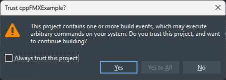
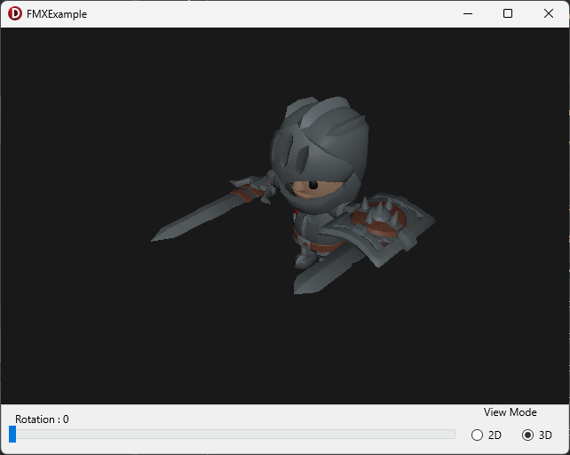

CGE Form Examples

This repo illustrates using Castle Game Engine both using Pascal and C++(Builder) using both FMX and VCL frameworks sharing the CGE code

If you are using Delphi Community Edition please start with DelphiCE.groupproj

If you are using C++Builder Community Edition please start with CBuilderCE.groupproj

If you are using Rad Studio (i.e. paid Delphi) please start with RadStudio.groupproj

VCL/FMX are used here as holding elements for a TCastleWindow and as inputs to the CGE part of the application. The separate CastleAppUnit.(pas/cpp) is shared between the relevant parent frameworks.

It should be noted that when compiling you will see a pop-up warning you may not have encountered before that looks like this...

This warning is due to a build event that copies the data directory to the relevant output folder. All it's doing is issuing a command like "xcopy data Pascal\FMX\Win64\Debug" to ensure that when run the application has the data files it expects where they're supposed to be.

Note that this copy action is only required for this repo. Your own projects won't have the same directory structure as this one. CGE can sensibly locate your own data directory.

Compilation of this example will result in a window like this (no matter what language or framework is used to compile it)

